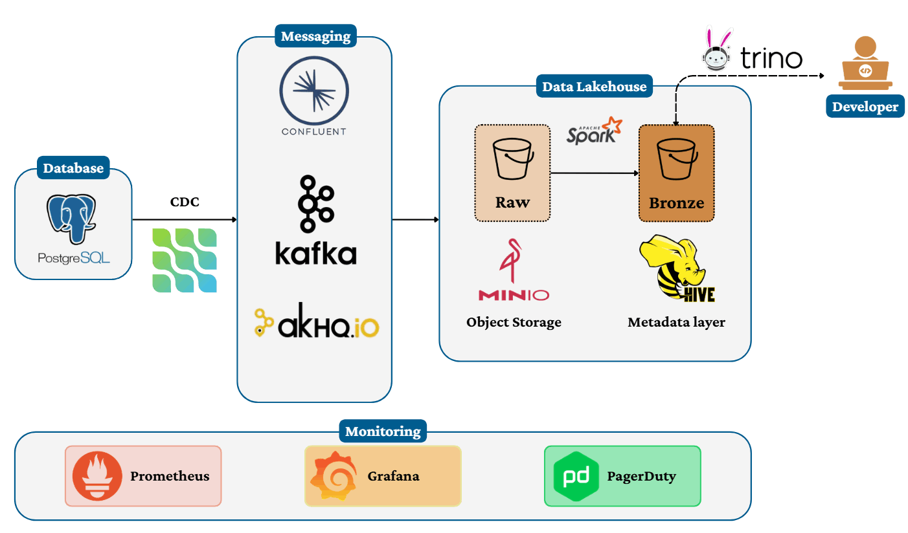
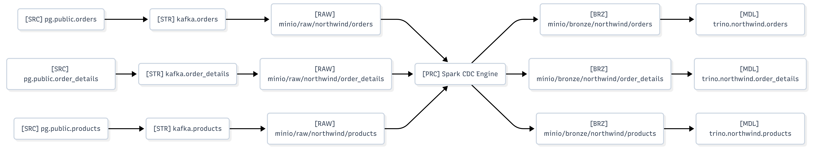
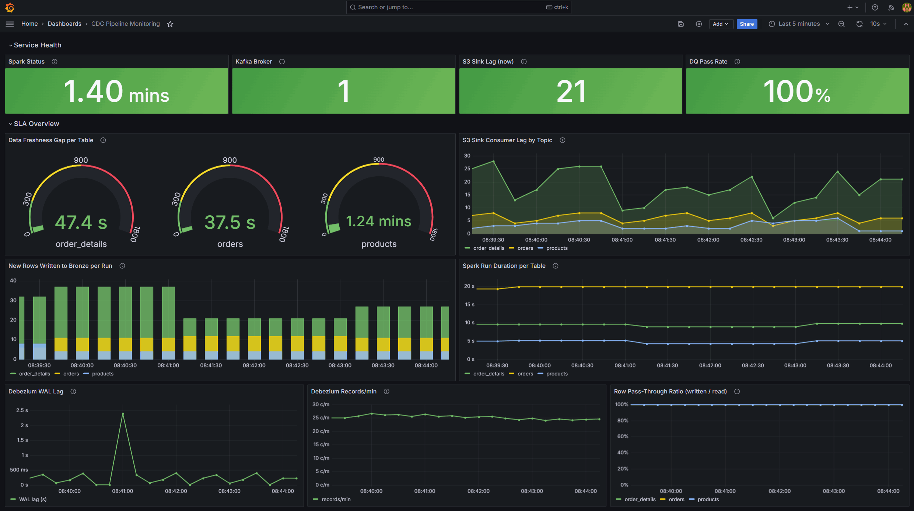
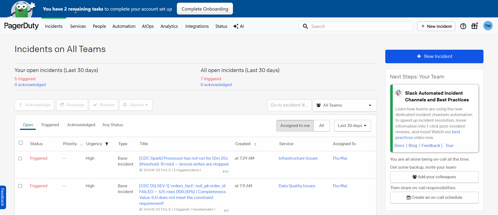
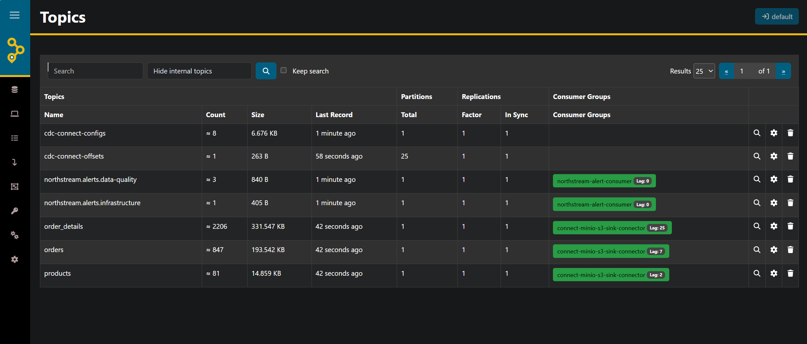
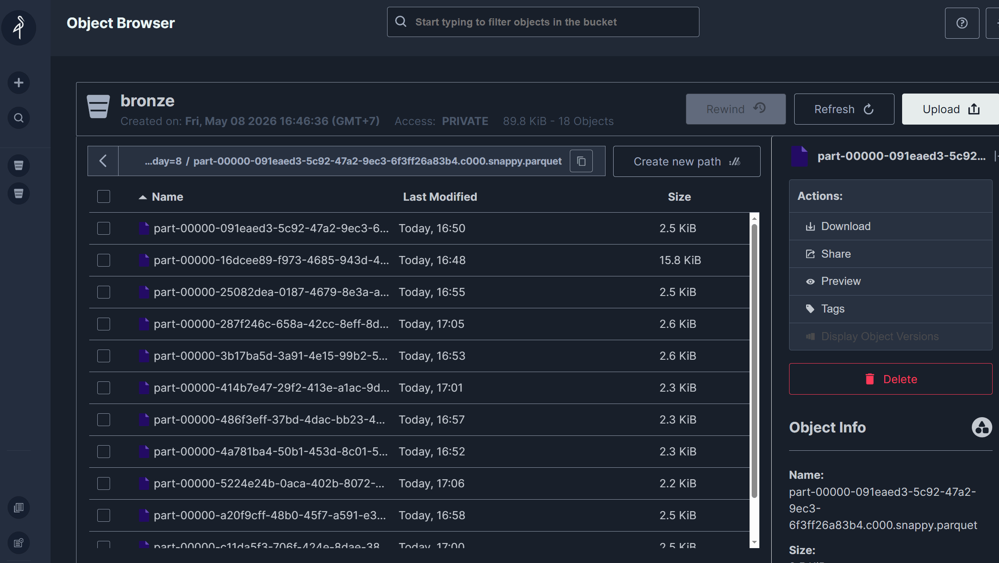
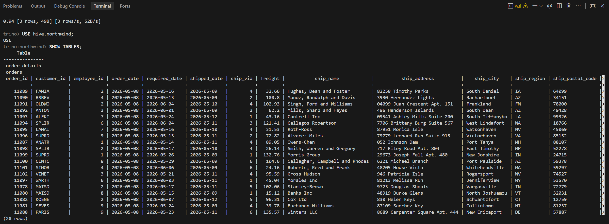

# 🌊 NorthStream - Real-Time CDC Data Replication Pipeline

> A proof-of-concept platform that continuously replicates PostgreSQL changes into an isolated analytics environment, giving developers production-like data without touching production.


# 💥 The Problem

Debugging with production data is risky. Traditional workarounds — manual snapshots, staging copies — go stale quickly and can't reproduce live incidents. Direct queries on production risk performance and data exposure.

NorthStream solves this with a real-time CDC pipeline: changes stream from PostgreSQL into a fully isolated environment, keeping analytical data fresh without any production impact.

# 🛠️ Technology Stack

| Layer | Technologies |
|---|---|
| CDC | Debezium, Kafka Connect |
| Streaming | Apache Kafka, Schema Registry |
| Storage | MinIO |
| Processing | Apache Spark |
| Data Quality | Deequ |
| Query Engine | Trino |
| Monitoring | Prometheus, Grafana |
| Alerting | PagerDuty |
| UI | AKHQ |
| Containerization | Docker Compose |

# 🌟 System Architecture

<p align="center">
  
</p>

<p align="center">
  System Architecture
</p>


# 📁 Repository Structure

```shell
├── README.md
├── alerting
│   ├── Dockerfile
│   ├── kafka_alert_consumer.py
│   ├── requirements.txt
│   └── webhook_receiver.py
├── connectors
│   ├── debezium-postgres.json
│   └── s3-sink-minio-production.json
├── create-alert-topics.sh
├── docker-compose.yaml
├── generator
│   ├── Dockerfile
│   ├── data_generator.py
│   └── requirements-generator.txt
├── imgs
│   ├── AKHQ_Topics.png
│   ├── Alert.png
│   ├── Architecture.png
│   ├── Bronze_bucket.png
│   ├── DataLineage.png
│   ├── Monitoring.png
│   └── TrinoQuery.png
├── monitoring
│   ├── grafana
│   │   ├── alerting
│   │   │   └── alerting.yaml
│   │   ├── dashboards
│   │   │   ├── cdc_pipeline.json
│   │   │   └── dashboard.yaml
│   │   └── datasources
│   │       └── prometheus.yaml
│   ├── jmx
│   │   └── kafka-connect-jmx.yml
│   └── prometheus.yml
├── postgres
│   └── init.sql
├── register-connectors.sh
├── spark
│   ├── Dockerfile
│   ├── entrypoint.sh
│   ├── requirements.txt
│   ├── spark-app
│   │   ├── alert.py
│   │   ├── cdc_processor.py
│   │   ├── deequ_checks.py
│   │   ├── init_hive.py
│   │   └── test_dq_alert.py
│   └── spark-config
│       ├── core-site.xml
│       └── hive-site.xml
└── trino
    ├── catalog
    │   └── hive.properties
    └── etc
        ├── config.properties
        ├── jvm.config
        └── node.properties
```


# 🚀 Getting Started

1. **Clone the repository**

```bash
git clone <repository-url>
cd NorthStream
```

2. **Configure environment variables**

```bash
cp .env.example .env
```

3. **Start the infrastructure**

```bash
docker compose up -d --build
```

4. **Verify running services**

```bash
docker compose ps
```

5. **Register Kafka Connect connectors**

```bash
bash register-connectors.sh
```

The script will:
- Create MinIO buckets
- Register Debezium connector
- Register S3 Sink connector
- Validate connector status


# 🔄 CDC Data Flow

```text
PostgreSQL
   ↓
Debezium
   ↓
Kafka
   ↓
S3 Sink Connector
   ↓
MinIO (raw)
   ↓
Spark CDC Processor
   ↓
MinIO (bronze)
   ↓
Trino
```


# 🔍 Query Data with Trino

```bash
docker exec -it trino trino
```

```sql
SHOW SCHEMAS FROM hive;

USE hive.northwind;

SHOW TABLES;

SELECT *
FROM orders
LIMIT 20;
```

# 🗄️ Data Lineage

<p align="center">
  
</p>

<p align="center">
  Data Lineage
</p>


# 📊 Monitoring & Alerting

<p align="center">
  
</p>
<p align="center">
  Granafa Monitor
</p>


## Data Quality Checks

| Check | Rule |
|---|---|
| Non-empty | Table must contain rows |
| Null PK | No NULL primary keys |
| Unique PK | No duplicate primary keys |
| Valid cdc_op | `cdc_op` ∈ `{c, u, r}` |
| Freshness | CDC freshness SLA |

## Alert Rules

| Alert | Condition |
|---|---|
| Kafka Consumer Lag | Lag > threshold |
| Spark Not Running | No metrics update for > 10 min |
| Freshness SLA Breach | CDC delay > 15 min |

---

## 🧪 Testing Alerts

The test suite lives in `spark/spark-app/test_dq_alert.py` and is run via `spark-submit` inside the `spark-cdc` container. Each test simulates a specific failure scenario end-to-end, from data quality evaluation through to PagerDuty delivery.

> **Prerequisites:** Ensure `PAGERDUTY_ROUTING_KEY` is set in your `.env` before running live tests. If the key is not set, the suite automatically falls back to dry-run mode (alerts are logged but not delivered).

### List available tests

```bash
docker exec spark-cdc /opt/spark/bin/spark-submit \
  --master local[1] \
  --jars "/opt/spark/extra-jars/hadoop-aws.jar,/opt/spark/extra-jars/aws-java-sdk-bundle.jar,/opt/spark/extra-jars/deequ.jar" \
  /app/spark-app/test_dq_alert.py --list
```


### T1 — SEV-1 Data Quality: Critical DQ Failures

Runs `run_dq_checks()` against five synthetic DataFrames to cover every failure path:

| Scenario | Input | Expected outcome |
|---|---|---|
| 1 | Good data | All checks pass, no alert |
| 2 | 100% NULL primary key | `FAIL` → PagerDuty `critical` alert |
| 3 | Duplicate primary key | `FAIL` → PagerDuty `critical` alert |
| 4 | Invalid `cdc_op` (`d`) | `FAIL` → PagerDuty `error` alert |
| 5 | Empty table | `FAIL` → PagerDuty `error` alert |

```bash
docker exec spark-cdc /opt/spark/bin/spark-submit \
  --master local[1] \
  --jars "/opt/spark/extra-jars/hadoop-aws.jar,/opt/spark/extra-jars/aws-java-sdk-bundle.jar,/opt/spark/extra-jars/deequ.jar" \
  /app/spark-app/test_dq_alert.py --test t1
```


### T2 — Freshness SLA Breach & Auto-Resolve

Directly calls `send_alert()` with a simulated stale-data gap (threshold + 3 min), then calls `resolve_alert()` to confirm the PagerDuty incident auto-closes. Does not require Spark to be actively processing.

| Phase | Action | Expected outcome |
|---|---|---|
| 1 | Fire freshness breach alert | PagerDuty incident opened (`critical`) |
| 2 | Resolve the breach | PagerDuty incident auto-resolved |

```bash
docker exec spark-cdc /opt/spark/bin/spark-submit \
  --master local[1] \
  --jars "/opt/spark/extra-jars/hadoop-aws.jar,/opt/spark/extra-jars/aws-java-sdk-bundle.jar,/opt/spark/extra-jars/deequ.jar" \
  /app/spark-app/test_dq_alert.py --test t2
```
# 🆘 PagerDuty Alerting
<p align="center">
  
</p>
<p align="center">
PagerDuty Alert
</p>

# 🌐 Service Interfaces

| Interface | URL |
|---|---|
| AKHQ | http://localhost:8090 |
| MinIO | http://localhost:9001 |
| Trino | http://localhost:8080 |
| Grafana | http://localhost:3000 |

---

# 🖥️ User Interfaces

## AKHQ UI

<p align="center">
  
</p>
<p align="center">
  Kafka Topics
</p>

## MinIO Console

<p align="center">
  
</p>
<p align="center">
MinIO bronze bucket
</p>

## Trino Query UI

<p align="center">
  
</p>
<p align="center">
  Trino CLI Query
</p>
# 🙏 Acknowledgements

We would like to sincerely thank our mentor for the guidance, support, and valuable feedback throughout the development of this project.

Your mentorship helped our team better understand modern data engineering concepts and successfully build this real-time CDC pipeline system.