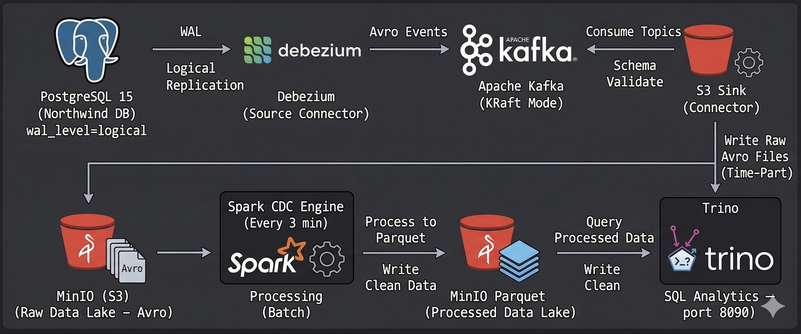

# 🌀 DatebayoZenith — CDC Northwind Pipeline


> **Complete CDC (Change Data Capture) Pipeline** — automatically captures every data change from PostgreSQL, streams it to MinIO via Kafka, processes Avro→Parquet with Spark, registers table metadata in Hive Metastore, and exposes it for SQL analytics via Trino.

---

## 📐 Architecture Overview


**Full Data Flow**:

---

## 📚 Documentation

All technical documentation is located in the `docs/` directory and component subfolders:

| Document | Description |
|---|---|
| [📐 Architecture](docs/architecture.md) | System architecture, detailed data flow, and design decisions |
| [📋 Contracts](docs/contracts.md) | Naming conventions, Avro schema, S3 layout — commitments between teams |
| [🔌 Connectors](docs/connectors.md) | Detailed explanation of each field in the Kafka Connect configuration |
| [🚀 Local Setup](docs/local-setup.md) | Step-by-step guide to running the pipeline on a local machine |
| [⚡ Spark README](spark/README.md) | Spark CDC Processing Engine — Avro→Parquet, schedule, deduplication |
| [🔍 Trino README](trino/README.md) | Trino Query Engine — schema, queries, troubleshooting |

---

## 🏗️ Hive Metastore

The pipeline uses **Apache Hive Metastore 3.1.3** as the centralized metadata catalog. It acts as the bridge between Spark (which writes Parquet) and Trino (which reads Parquet) — both communicate through Hive Metastore to understand table schemas, partition layouts, and data locations on MinIO.

### Why Hive Metastore?

```
┌──────────┐         ┌──────────────────┐         ┌──────────┐
│  Spark   │────────▶│  Hive Metastore  │◀────────│  Trino   │
│ (writer) │  CREATE │  (Thrift :9083)  │  READ   │ (reader) │
│          │  TABLE  │                  │  SCHEMA │          │
└──────────┘         └────────┬─────────┘         └──────────┘
                              │
                    ┌─────────▼─────────┐
                    │   metastore-db    │
                    │  (PostgreSQL 15)  │
                    │   port: 5433      │
                    └───────────────────┘
```

Without a shared metastore, Spark and Trino cannot agree on table definitions. Hive Metastore solves this by storing all metadata (database names, table schemas, partition info, S3 locations) in a dedicated PostgreSQL instance (`metastore-db`).

### Infrastructure Components

| Component | Image / Build | Port | Purpose |
|---|---|---|---|
| `metastore-db` | `postgres:15` | `5433` (host) → `5432` (container) | Persistent storage for Hive metadata |
| `hive-metastore` | Custom build (`./hive`) | `9083` | Thrift RPC server for schema operations |

### Configuration Files

| File | Description |
|---|---|
| `hive/Dockerfile` | Builds Hive 3.1.3 + Hadoop 3.3.4 with S3A and PostgreSQL JDBC support |
| `hive/conf/hive-site.xml` | Metastore connection (JDBC → `metastore-db`), warehouse dir (`s3a://northwind-data-lake/warehouse/`) |
| `hive/conf/core-site.xml` | S3A filesystem config (MinIO endpoint, credentials, path-style access) |
| `hive/entrypoint.sh` | Waits for PostgreSQL, initializes schema via `schematool`, starts Thrift server |

### How It Works in the Pipeline

1. **Startup** — `hive-metastore` container starts, connects to `metastore-db`, and initializes the Hive schema (if first run).
2. **Table Registration** — Spark's `init_hive.py` runs at boot: creates the `northwind` database and 4 external tables (`customers`, `orders`, `order_details`, `products`) pointing to S3A/MinIO locations.
3. **Partition Sync** — After each CDC processing cycle, `cdc_processor.py` registers new partitions (`year/month/day`) in Hive via `ALTER TABLE ... ADD PARTITION`.
4. **Query** — Trino connects to Hive Metastore via `thrift://hive-metastore:9083` (configured in `trino/etc/catalog/hive.properties`), reads table schemas and partition metadata, then queries Parquet files directly from MinIO.

### Registered Tables

| Hive Table | Primary Key | Partition Columns | S3 Location |
|---|---|---|---|
| `northwind.customers` | `customer_id` | `year`, `month`, `day` | `s3a://northwind-data-lake/northwind/customers/` |
| `northwind.orders` | `order_id` | `year`, `month`, `day` | `s3a://northwind-data-lake/northwind/orders/` |
| `northwind.order_details` | `order_id`, `product_id` | `year`, `month`, `day` | `s3a://northwind-data-lake/northwind/order_details/` |
| `northwind.products` | `product_id` | `year`, `month`, `day` | `s3a://northwind-data-lake/northwind/products/` |

> All tables include CDC metadata columns: `cdc_ts_ms` (event timestamp) and `cdc_op` (operation type: `c`=create, `u`=update, `r`=snapshot read).

---

## 🗂️ Repository Structure

```
DatebayoZenith/
│
├── 📄 README.md                      # Overview documentation (this file)
├── 📄 docker-compose.yaml            # Local infrastructure definition
├── 📄 .env.example                   # Environment variables template
├── 📄 register-connectors.sh         # Register connectors via REST API
│
├── 📁 docs/                          # Architecture & data contract documentation
│   ├── architecture.md               # End-to-end system design
│   ├── contracts.md                  # Data & Infrastructure contracts
│   ├── connectors.md                 # Connector configuration guide
│
├── 📁 connectors/                    # Kafka Connect plugin configurations
│   ├── debezium-postgres.json        # Source connector (CDC from Postgres)
│   └── s3-sink-minio-production.json # Sink connector (writes to MinIO)
│
├── 📁 postgres/                      # Source database initialization
│   ├── init.sql                      # Northwind schema + seed data
│   └── README.md                     # Postgres CDC configuration guide
│
├── 📁 generator/                     # 🔄 Simulated Data Generator
│   ├── Dockerfile                    # Python-based generator image
│   ├── data_generator.py             # Produces INSERT/UPDATE events on Northwind tables
│   └── requirements-generator.txt    # Python dependencies
│
├── 📁 hive/                          # 🐝 Hive Metastore Service
│   ├── Dockerfile                    # Hive 3.1.3 + Hadoop 3.3.4 + S3A JARs
│   ├── entrypoint.sh                 # Schema init + Thrift server startup
│   └── conf/
│       ├── hive-site.xml             # JDBC connection, warehouse dir, Thrift config
│       └── core-site.xml             # S3A filesystem (MinIO endpoint, credentials)
│
├── 📁 spark/                         # ⚡ Spark CDC Processing Engine
│   ├── Dockerfile                    # apache/spark:3.5.1-python3 + Avro/S3A JARs
│   ├── entrypoint.sh                 # Init Hive tables → scheduler loop (every 60s)
│   ├── requirements.txt              # Python dependencies
│   ├── conf/
│   │   ├── hive-site.xml             # Points Spark to hive-metastore:9083
│   │   └── core-site.xml             # S3A config for MinIO access
│   └── app/
│       ├── init_hive.py              # Creates database + external tables in Hive
│       └── cdc_processor.py          # Avro→Parquet: read, dedupe, merge, partition
│
└── 📁 trino/                         # 🔍 Trino SQL Query Engine
    └── etc/
        ├── config.properties          # Server config (coordinator, port 8080)
        ├── jvm.config                 # JVM memory settings
        ├── node.properties            # Node identification
        └── catalog/
            └── hive.properties        # Hive connector → MinIO via hive-metastore:9083
```

---

## 🚀 Pipeline Workflow — How to Run

### Step 1 — Prepare Environment Configuration

```bash
cp .env.example .env
# Edit .env if you need to change default credentials
```

Default credentials in `.env.example`:
| Variable | Default |
|---|---|
| `MINIO_ROOT_USER` | `admin` |
| `MINIO_ROOT_PASSWORD` | `admin123` |
| `PG_USER` | `postgres` |
| `PG_PASSWORD` | `postgres` |

### Step 2 — Start the Entire Infrastructure

```bash
docker compose up -d
```

### Step 3 — Verify All Containers Are Running

```bash
docker compose ps
```

### Step 4 — Register Kafka Connect Connectors

```bash
# Run from the project root directory
bash register-connectors.sh
```


### Step 5 — Query Data with Trino

**Open the Trino CLI:**
```bash
docker exec -it trino trino
```

**Explore the catalog:**

- **List all schemas**
```sql
SHOW SCHEMAS FROM hive;
```

- **Switch to northwind schema**
```sql
USE hive.northwind;
```

- **List all tables**
```sql
SHOW TABLES;
```

- **Inspect a table schema**
```sql
DESCRIBE hive.northwind.orders;
```

- **Run analytical queries**
```sql
-- Orders with customer details
SELECT
    o.order_id,
    c.company_name,
    c.contact_name,
    o.order_date,
    o.ship_country,
    o.freight
FROM hive.northwind.orders o
JOIN hive.northwind.customers c
    ON o.customer_id = c.customer_id
ORDER BY o.order_date DESC
LIMIT 20;
```

### Step 7 — Access Web UIs

| Interface | URL | Purpose |
|---|---|---|
| **AKHQ** (Kafka UI) | http://localhost:8080 | View topics, messages, consumer groups |
| **MinIO** (S3 UI) | http://localhost:9001 | Browse Avro & Parquet files |
| **Kafka Connect REST** | http://localhost:8083 | Manage connectors via API |
| **Schema Registry** | http://localhost:8081 | View registered Avro schemas |
| **Trino UI** | http://localhost:8088 | SQL query monitoring & analytics |


---
## 📖 Further Reading

- Detailed Architecture → [docs/architecture.md](docs/architecture.md)
- Conventions and Data Contracts → [docs/contracts.md](docs/contracts.md)
- Connector Configuration → [docs/connectors.md](docs/connectors.md)
- Spark CDC Engine → [spark/README.md](spark/README.md)
- Trino Query Engine → [trino/README.md](trino/README.md)
