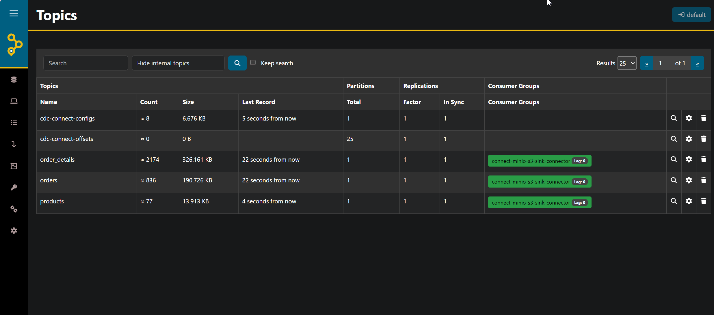
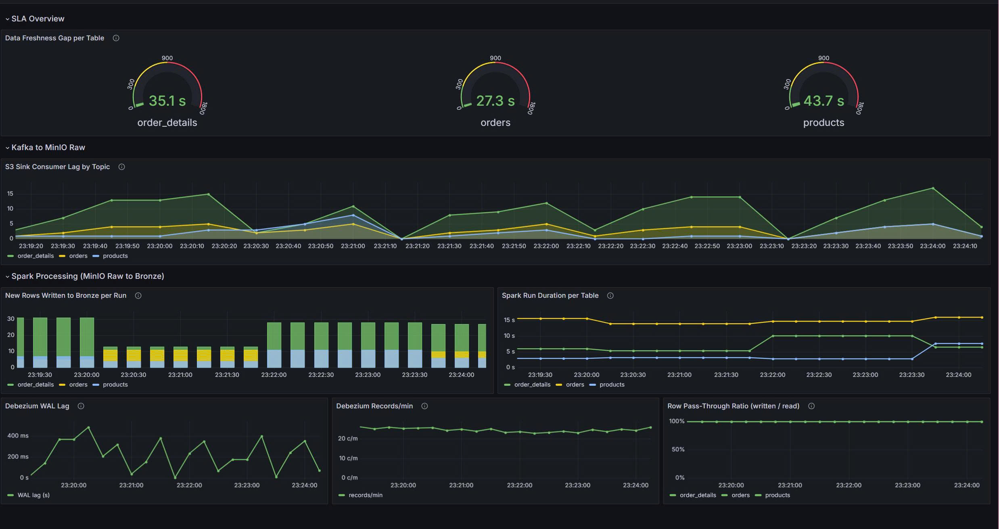

# NorthStream

> **Production-grade CDC Pipeline** — captures every row-level change from a PostgreSQL Northwind database, streams it through Kafka in Avro format, converts to Parquet via Spark, runs automated data-quality checks with Deequ, exposes the results for SQL analytics through Trino, and monitors end-to-end pipeline health with Prometheus, Grafana, and PagerDuty alerting.

---

## Architecture


### Data Flow

```
PostgreSQL (Northwind)
  │  WAL (logical replication)
  ▼
Debezium (Kafka Connect source connector)
  │  CDC events (Avro + Schema Registry)
  ▼
Kafka (KRaft, single-node)
  │  Topics: orders, order_details, products
  ▼
S3 Sink Connector (Kafka Connect)
  │  Avro files, time-partitioned (year/month/day)
  ▼
MinIO  ──  raw bucket
  │
  ▼
Spark CDC Processor (scheduled every 60s)
  │
  ▼
MinIO  ──  bronze bucket (Parquet)
  │
  ▼
Trino (via Hive Metastore)
  └── SQL analytics
```

---

## Infrastructure

| Service | Role |
|---|---|
| **Kafka** | KRaft broker + controller |
| **Schema Registry** | Avro schema management |
| **Kafka Connect** | Hosts Debezium source + S3 Sink connectors |
| **AKHQ** | Kafka web UI (topics, consumers, schemas) |
| **MinIO** | S3-compatible object storage (raw + bronze buckets) |
| **PostgreSQL** | Northwind source database (WAL logical replication) |
| **Data Generator** | Inserts orders, products every 10 s (Faker) | — |
| **Spark** | Avro → Parquet incremental CDC processor + Deequ DQ |
| **Hive Metastore** | Schema catalog for Spark + Trino |
| **Metastore DB** | PostgreSQL backend for Hive Metastore |
| **Trino** | Distributed SQL query engine |
| **Pushgateway** | Receives batch metrics from Spark |
| **Prometheus** | Scrapes Pushgateway, Kafka Exporter, JMX Exporter |
| **Kafka Exporter** | Exports consumer-group lag metrics |
| **Grafana** | Dashboards + alert rules → PagerDuty |

---

## Repository Structure

```
DatebayoZenith/
├── docker-compose.yaml              
├── .env.example                     # Environment variables template
├── register-connectors.sh           # Waits for readiness, creates buckets, registers connectors
│
├── connectors/
│   ├── debezium-postgres.json       # Source: CDC from public.{orders,order_details,products}
│   └── s3-sink-minio-production.json # Sink: Avro → MinIO raw/, time-partitioned, flush every 50 records / 60 s
│
├── postgres/
│   └── init.sql                     # Northwind schema + seed data
│
├── generator/
│   ├── Dockerfile                   
│   ├── data_generator.py            
│   └── requirements-generator.txt  
│
├── spark/
│   ├── Dockerfile                   
│   ├── entrypoint.sh                
│   ├── requirements.txt             
│   ├── spark-config/
│   │   ├── hive-site.xml            
│   │   └── core-site.xml            
│   └── spark-app/
│       ├── init_hive.py             
│       ├── cdc_processor.py         
│       ├── deequ_checks.py          
│       ├── alert.py                 
│       └── test_dq_alert.py         
│
├── trino/
│   ├── etc/
│   │   ├── config.properties
│   │   ├── jvm.config
│   │   └── node.properties
│   └── catalog/
│       └── hive.properties          
│
├── monitoring/
│   ├── prometheus.yml               
│   ├── jmx/
│   │   └── kafka-connect-jmx.yml   
│   └── grafana/
│       ├── datasources/
│       │   └── prometheus.yaml
│       ├── dashboards/
│       │   ├── dashboard.yaml
│       │   └── cdc_pipeline.json   
│       └── alerting/
│           └── alerting.yaml        
│
└── imgs/
```

---

## Getting Started
### Step 1 — Configure Environment

```bash
cp .env.example .env
```

| Variable | Default | Description |
|---|---|---|
| `MINIO_ROOT_USER` | `admin` | MinIO access key |
| `MINIO_ROOT_PASSWORD` | `admin123` | MinIO secret key |
| `PG_USER` | `postgres` | PostgreSQL username |
| `PG_PASSWORD` | `postgres` | PostgreSQL password |
| `PAGERDUTY_ROUTING_KEY` | *(empty)* | Optional — alerts are log-only until set |

### Step 2 — Start the Pipeline

```bash
docker compose up -d --build
```
### Step 3 — Verify Services

```bash
docker compose ps
```
### Step 4 — Register Kafka Connect Connectors

```bash
bash register-connectors.sh
```

The script will:
1. Wait for MinIO, Schema Registry, and Kafka Connect to be ready
2. Create `raw` and `bronze` buckets in MinIO
3. Register the **Debezium PostgreSQL** source connector
4. Wait for Avro schemas to appear in Schema Registry
5. Register the **S3 Sink** connector
6. Print connector status

### Step 5 — Query with Trino

```bash
docker exec -it trino trino
```

```sql
-- List schemas
SHOW SCHEMAS FROM hive;

-- Switch to northwind
USE hive.northwind;

-- List tables
SHOW TABLES;

-- Query recent orders
SELECT * FROM orders ORDER BY order_date DESC LIMIT 20;

-- Join orders with details
SELECT o.order_id, o.customer_id, od.product_id, od.unit_price, od.quantity
FROM orders o
JOIN order_details od ON o.order_id = od.order_id
ORDER BY o.order_id DESC
LIMIT 50;
```

---

## AKHQ UI




## MinIO Browser UI


## Trino SQL Client UI


## Data Quality & Alerting

### Deequ Checks (Pre-Write Gate)

| Check | Rule | Severity |
|---|---|---|
| **Non-empty** | Table must have ≥ 1 row | `error` |
| **Null PK** | No NULLs in primary key columns | `critical` |
| **Unique PK** | No duplicate primary keys (composite-aware) | `critical` |
| **Valid cdc_op** | `cdc_op` ∈ {`c`, `u`, `r`} | `error` |
| **Freshness** | Latest `cdc_ts_ms` within 15-minute threshold | `error` |

### Grafana Alert Rules

| Alert | Condition | Fires After |
|---|---|---|
| **Kafka Consumer Lag** | S3 Sink consumer lag > 1,000 messages | 1 min |
| **Spark Not Running** | No `cdc_last_run_timestamp_seconds` update for > 10 min | 2 min |
| **Data Freshness SLA** | `cdc_freshness_gap_seconds` > 900 s (15 min) | 2 min |

All alerts route to PagerDuty via the `PAGERDUTY_ROUTING_KEY` contact point. If the key is not set, alerts are logged but not dispatched.

## Data Quality & Alerting

### Running the Alert Test Suite

```bash
# List available tests
docker exec spark-cdc /opt/spark/bin/spark-submit \
  --master local[1] \
  --jars "/opt/spark/extra-jars/deequ.jar" \
  /app/test_dq_alert.py --list

# Run DQ failure test (dry-run, no PagerDuty delivery)
docker exec spark-cdc /opt/spark/bin/spark-submit \
  --master local[1] \
  --jars "/opt/spark/extra-jars/hadoop-aws.jar,/opt/spark/extra-jars/aws-java-sdk-bundle.jar,/opt/spark/extra-jars/deequ.jar" \
  /app/test_dq_alert.py --test t1 --dry-run
```

| Test | Scenario |
|---|---|
| `t1` | DQ failure: null PK, duplicate PK, invalid cdc\_op, empty table |
| `t2` | Freshness breach → trigger alert → resolve alert |
| `t3` | Spark death simulation → Grafana Rule 2 fires → restore |

---

## Observability

### Metrics Pipeline

```
Spark CDC Processor → Pushgateway → Prometheus → Grafana
Kafka Exporter      ────────────→ Prometheus → Grafana
JMX Exporter (Debezium) ────────→ Prometheus → Grafana
```

### Key Metrics

| Metric | Source | Description |
|---|---|---|
| `cdc_rows_written_total` | Spark | Deduplicated rows written per table per run |
| `cdc_processing_duration_seconds` | Spark | Processing time per table |
| `cdc_freshness_gap_seconds` | Spark | Seconds since last CDC event reached bronze |
| `cdc_dq_check_status` | Spark | Per-check pass (1) / fail (0) |
| `cdc_consecutive_failures_total` | Spark | Streak of failed runs without a successful write |
| `kafka_consumergroup_lag` | Kafka Exporter | Consumer group offset lag |
| `debezium_metrics_millisecondsbehindource` | JMX | Debezium WAL replication lag |

---

## Web UIs

| Interface | URL | Credentials |
|---|---|---|
| **AKHQ** (Kafka UI) | http://localhost:8090 | — |
| **MinIO Console** | http://localhost:9001 | `admin` / `admin123` |
| **Trino UI** | http://localhost:8080 | — |
| **Grafana** | http://localhost:3000 | `admin` / `admin` |
| **Prometheus** | http://localhost:9090 | — |
| **Pushgateway** | http://localhost:9091 | — |

