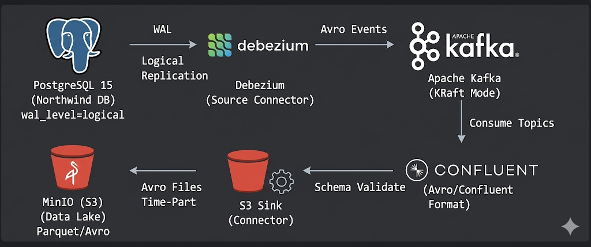

# 🌀 DatebayoZenith — CDC Northwind Pipeline


> **Complete CDC (Change Data Capture) Pipeline** — automatically captures every data change from PostgreSQL, streams it to MinIO via Kafka, processes Avro→Parquet with Spark, and exposes it for SQL analytics via Trino.

---

## 📐 Architecture Overview



**Full Data Flow**:
```
PostgreSQL  →  Debezium  →  Kafka  →  S3 Sink  →  MinIO (Avro)
                                                         │
                                                  Spark CDC Engine
                                                  (mỗi 3 phút)
                                                         │
                                                         ▼
                                                 MinIO (Parquet)
                                                         │
                                                         ▼
                                                      Trino
                                               (SQL Analytics — port 8090)
```

---

## 📚 Documentation

All technical documentation is located in the `docs/` directory and component subfolders:

| Document | Description |
|---|---|
| [📐 Architecture](docs/architecture.md) | System architecture, detailed data flow, and design decisions |
| [📋 Contracts](docs/contracts.md) | Naming conventions, Avro schema, S3 layout — commitments between teams |
| [🔌 Connectors](docs/connectors.md) | Detailed explanation of each field in the Kafka Connect configuration |
| [🚀 Local Setup](docs/local-setup.md) | Step-by-step guide to running the pipeline on a local machine |
| [⚡ Spark README](spark/README.md) | Spark CDC Processing Engine — Avro→Parquet, schedule, deduplication |
| [🔍 Trino README](trino/README.md) | Trino Query Engine — schema, queries, troubleshooting |

---

## 🗂️ Repository Structure

```
DatebayoZenith/
│
├── 📄 README.md                      # Overview documentation (this file)
├── 📄 docker-compose.yaml            # Local infrastructure definition
├── 📄 .env.example                   # Environment variables template
├── 📄 northwind.sql                  # Northwind sample data (backup)
│
├── 📁 docs/                          # Architecture & data contract documentation
│   ├── architecture.md               # End-to-end system design
│   ├── contracts.md                  # Data & Infrastructure contracts
│   ├── connectors.md                 # Connector configuration guide
│   └── local-setup.md                # Local setup guide
│
├── 📁 connectors/                    # Kafka Connect plugin configurations
│   ├── debezium-postgres.json        # Source connector (CDC from Postgres)
│   └── s3-sink-minio-production.json # Sink connector (writes to MinIO)
│
├── 📁 scripts/                       # Utility scripts
│   └── register-connectors.sh        # Register connectors via REST API
│
├── 📁 postgres/                      # Source database initialization
│   ├── init.sql                      # Northwind schema + seed data
│   └── README.md                     # Postgres CDC configuration guide
│
├── 📁 spark/                         # ⚡ Spark CDC Processing Engine
│   ├── Dockerfile                    # apache/spark:3.5.1-python3 + Avro/S3A JARs
│   ├── entrypoint.sh                 # Scheduler loop (mỗi 3 phút)
│   ├── cdc_processor.py              # Logic: đọc Avro → dedupe → ghi Parquet
│   ├── requirements.txt              # Python deps
│   └── README.md                     # Spark documentation
│
└── 📁 trino/                         # 🔍 Trino SQL Query Engine
    ├── etc/                          # Server config (port 8090, JVM, Hive catalog)
    │   └── catalog/hive.properties   # Kết nối MinIO qua file metastore
    ├── init/create_tables.sql        # DDL tạo 4 external tables Northwind
    ├── mock/mock_parquet_generator.py # Mock data để test trước Spark
    └── README.md                     # Trino documentation
```

---

## ⚡ Quick Start

### System Requirements

| Tool | Minimum Version |
|---|---|
| Docker | 24.x or higher |
| Docker Compose | 2.x or higher |
| curl | Any (used to register connectors) |
| Bash | Git Bash / WSL / Linux / macOS |

### Startup Steps

**Step 1 — Prepare environment configuration**
```bash
cp .env.example .env
# Edit .env if you need to change credentials
```

**Step 2 — Start the entire infrastructure**
```bash
docker-compose up -d
```
> ⏳ The first run will take 5–10 minutes to download images and install connector plugins.

**Step 3 — Verify all containers are running**
```bash
docker-compose ps
```
Expected result: all services are in the `Up` state.

**Step 4 — Register Kafka Connect Connectors**
```bash
# Run from the project root directory
bash scripts/register-connectors.sh
```

**Step 5 — Initialize Trino tables**

```bash
# Đợi Trino healthy (~30s), sau đó tạo 4 external tables
docker exec -it trino trino --file /init/create_tables.sql
```

**Step 6 — Access Web UIs for verification**

| Interface | URL | Purpose |
|---|---|---|
| **AKHQ** (Kafka UI) | http://localhost:8080 | View topics, messages, consumer groups |
| **MinIO** (S3 UI) | http://localhost:9001 | Browse Avro & Parquet files |
| **Kafka Connect REST** | http://localhost:8083 | Manage connectors via API |
| **Schema Registry** | http://localhost:8081 | View registered Avro schemas |
| **Trino UI** | http://localhost:8090 | SQL query monitoring & analytics |

> See more detailed instructions at [docs/local-setup.md](docs/local-setup.md).

**Step 7 — Query data với Trino (sau khi Spark chạy xong lần đầu)**

```bash
docker exec -it trino trino
```
```sql
-- Sync partitions sau khi Spark ghi data
CALL hive.system.sync_partition_metadata('northwind', 'orders', 'FULL');
-- Query thử
SELECT COUNT(*) FROM hive.northwind.orders;
```

---

## 🔧 Common Troubleshooting

| Symptom | Cause | Solution |
|---|---|---|
| `kafka-connect` restarts continuously | Downloading connector plugins | Wait 3–5 minutes, plugins need to download |
| Script reports connection refused | Kafka Connect not ready yet | Script automatically waits — be patient |
| MinIO bucket cannot be created | Credentials mismatch | Check `MINIO_ROOT_USER/PASSWORD` in `.env` |
| Connector in `FAILED` state | Postgres logical replication not enabled | Check `wal_level=logical` in docker-compose |
| Parquet files không xuất hiện | Spark chưa chạy | Kiểm tra `docker logs spark-cdc` |
| Trino trả về 0 rows | Partition chưa sync | Chạy `CALL hive.system.sync_partition_metadata(...)` |
| Trino `Table not found` | Tables chưa tạo | Chạy `docker exec -it trino trino --file /init/create_tables.sql` |

---

## 📖 Further Reading

- Detailed Architecture → [docs/architecture.md](docs/architecture.md)
- Conventions and Data Contracts → [docs/contracts.md](docs/contracts.md)
- Connector Configuration → [docs/connectors.md](docs/connectors.md)
- Spark CDC Engine → [spark/README.md](spark/README.md)
- Trino Query Engine → [trino/README.md](trino/README.md)
