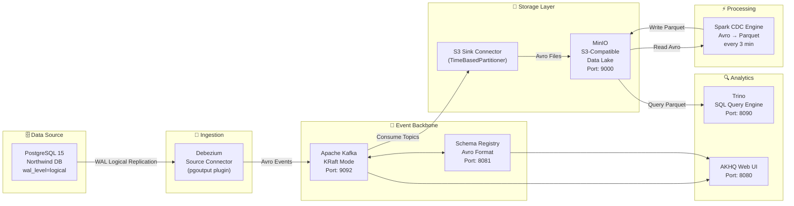

# 📐 Pipeline Architecture

This document describes the end-to-end architecture of the CDC (Change Data Capture) Pipeline — from the PostgreSQL source database, through Kafka and MinIO, to the Spark processing layer and the Trino SQL query engine.

---

## Overall Data Flow


> **Flow Description**: PostgreSQL records changes in the WAL → Debezium reads the WAL via Logical Replication → pushes Avro events to Apache Kafka (KRaft Mode) → Schema Registry validates the Avro structure → S3 Sink Connector consumes topics and writes day-partitioned Avro files to MinIO → **Spark CDC Engine reads Avro, deduplicates, and writes clean Parquet back to MinIO every 3 minutes** → **Trino serves SQL queries directly on the Parquet files**.

<details>
<summary>📊 View diagram as text (Mermaid)</summary>



</details>

---

## Component Details

### 1. 🗄️ PostgreSQL 15 — Data Source

**Container**: `postgres-db` | **Port**: `5432`

This is the relational database system (OLTP) containing the **Northwind** schema — a simulated e-commerce dataset with tables like `orders`, `order_details`, `products`, and `customers`.

**Critical CDC Configuration** (set in `docker-compose.yaml`):

| Parameter | Value | Meaning |
|---|---|---|
| `wal_level` | `logical` | Enables Logical Decoding for Debezium to read the WAL |
| `max_replication_slots` | `10` | Maximum number of replication slots |
| `max_wal_senders` | `10` | Number of simultaneous WAL sender connections |

> **WAL (Write-Ahead Log)**: Postgres records all changes to the WAL before applying them to disk. Debezium reads this WAL to capture INSERT/UPDATE/DELETE events **without requiring triggers or polling**.

**Tables Monitored by CDC**:
- `public.orders`
- `public.order_details`
- `public.products`
- `public.customers`

---

### 2. 📡 Debezium Source Connector — Change Collection

**Plugin**: `debezium-connector-postgresql:2.4.2` | **Config**: [`connectors/debezium-postgres.json`](../connectors/debezium-postgres.json)

Debezium is a **Kafka Connect plugin** that acts as a consumer of the Postgres WAL. It:

1. **Reads the WAL** continuously via the `pgoutput` plugin (native to Postgres 10+)
2. **Converts** each change into a structured **Avro event** wrapped in a standard Debezium envelope
3. **Pushes** the event to the corresponding Kafka topic following the pattern `{topic.prefix}.{schema}.{table}`

**`REPLICA IDENTITY FULL` Mechanism**: By default, Postgres only logs the `after` value during an UPDATE. With `FULL`, the `before` value (snapshot of old data) is also recorded — necessary for downstream systems to handle diffs.

```
Topics Created:
  northwind.public.orders
  northwind.public.order_details
  northwind.public.products
  northwind.public.customers
```

---

### 3. 🚀 Apache Kafka — Event Backbone

**Image**: `confluentinc/cp-kafka:7.4.0` | **Port**: `9092` (external), `29092` (internal)

Kafka serves as the **immutable, ordered, fault-tolerant buffer** for the entire pipeline.

**KRaft Mode (ZooKeeper-less)**:

```
Traditional: Kafka + ZooKeeper (2 systems)
KRaft Mode:   Kafka manages its own metadata (1 system)
```

| Reasons for Choosing KRaft | Explanation |
|---|---|
| Simplification | No need to deploy & maintain ZooKeeper |
| Production-ready | Kafka 3.x officially supports it since version 3.3+ |
| Reduced Latency | Fewer network hops during leader election |

---

### 4. 📋 Schema Registry — Schema Governance

**Image**: `confluentinc/cp-schema-registry:7.4.0` | **Port**: `8081`

Schema Registry stores **Avro schemas** centrally and enforces them when producers write or consumers read.

**Why Avro instead of JSON?**

| Criterion | Avro | JSON |
|---|---|---|
| Size | ✅ Small (binary) | ❌ Large (text) |
| Schema enforcement | ✅ Mandatory | ❌ Optional |
| Schema evolution | ✅ Backward/Forward compat | ❌ No control |
| Read/Write speed | ✅ Faster | ❌ Slower |

---

### 5. 💾 S3 Sink Connector — Writing to Data Lake

**Plugin**: `kafka-connect-s3:10.5.7` | **Config**: [`connectors/s3-sink-minio-production.json`](../connectors/s3-sink-minio-production.json)

This connector consumes Kafka topics and writes the data as **time-partitioned Avro files** into MinIO.

**Flush Mechanism**:
```
Flush when: record count >= 50 (flush.size)
        OR: time elapsed >= 60 seconds (rotate.interval.ms)
(whichever condition is met first)
```

**Partitioning layout in MinIO**:
```
northwind-data-lake/
└── topics/
    └── northwind.public.orders/
        └── year=2024/
            └── month=01/
                └── day=15/
                    ├── northwind.public.orders+0+0000000000.avro
                    └── northwind.public.orders+0+0000000050.avro
```

---

### 6. 🪣 MinIO — S3-Compatible Data Lake

**Image**: `minio/minio` | **API Port**: `9000` | **UI Port**: `9001`

MinIO is object storage that is **fully compatible with the Amazon S3 API**. Any tool using the AWS S3 SDK can be used with MinIO (Spark, Trino, dbt, etc.).

MinIO stores **two layers** of data in this pipeline:

| Prefix | Written by | Read by | Format |
|---|---|---|---|
| `topics/` | S3 Sink Connector | Spark CDC Engine | Avro (Debezium envelope) |
| `parquet/` | Spark CDC Engine | Trino | Parquet (Snappy, Hive-partitioned) |

---

### 7. ⚡ Spark CDC Engine — Avro → Parquet Processor

**Container**: `spark-cdc` | **Image**: `apache/spark:3.5.1-python3` | **Source**: [`spark/`](../spark/)

Spark runs as a **scheduled batch job** (every 3 minutes) that bridges the raw Avro layer and the Parquet analytics layer:

| Step | Action |
|---|---|
| 1. Read | Load all `.avro` files from `topics/<table>/` recursively |
| 2. Filter | Keep only `op IN ('c','u','r')` and `after IS NOT NULL` |
| 3. Flatten | Expand the `after` struct into top-level columns |
| 4. Rename | `ts_ms` → `cdc_ts_ms`, `op` → `cdc_op` |
| 5. Deduplicate | Last-Write-Wins per primary key using `Window.row_number()` |
| 6. Partition | Add `year / month / day` columns (UTC) |
| 7. Write | Output Parquet to `parquet/<table>/year=.../month=.../day=.../` |

See [`spark/README.md`](../spark/README.md) for full details.

---

### 8. 🔍 Trino — SQL Analytics Engine

**Container**: `trino` | **Image**: `trinodb/trino:435` | **Port**: `8090` | **Source**: [`trino/`](../trino/)

Trino provides **distributed SQL query** capabilities directly on the Parquet files in MinIO — using the **Hive connector** with a file-based metastore (no separate Hive Metastore service required).

**Key properties**:
- Catalog: `hive` → Schema: `northwind` → Tables: `orders`, `order_details`, `products`, `customers`
- External tables — Trino never owns the data, Spark writes it
- Partition pruning via `year/month/day` for efficient range scans
- Credentials for MinIO passed via `AWS_ACCESS_KEY_ID / AWS_SECRET_ACCESS_KEY` environment variables

See [`trino/README.md`](../trino/README.md) for full details.

---

### 9. 🔍 AKHQ — Kafka Web UI

**Image**: `tchiotludo/akhq` | **Port**: `8080`

A web interface for:
- Viewing topics and messages in real-time
- Checking consumer group lag
- Viewing schemas registered in Schema Registry
- Monitoring the status of Kafka Connect connectors

---

## Design Decisions

| Decision | Choice | Reason |
|---|---|---|
| Kafka mode | KRaft (ZooKeeper-less) | Simplifies infrastructure, stable in Confluent 7.4 |
| Serialization | Avro + Schema Registry | Type-safe, compact, supports schema evolution |
| Sink format | Avro → Parquet (two-layer) | S3 Sink writes Avro natively; Spark converts to Parquet for analytics |
| Partitioning | TimeBasedPartitioner (daily) + Hive-style | Consistent `year=X/month=XX/day=XX` layout across Avro and Parquet layers |
| CDC plugin | `pgoutput` (native) | No additional extensions required in Postgres |
| Processing engine | Apache Spark 3.5.1 (local mode) | Handles Avro reading, deduplication, and Parquet writing with a single image |
| Metastore | Hive file metastore (built into Trino) | No separate HMS service needed — simpler local development setup |
| Query engine | Trino 435 | Federated SQL queries directly on object storage without data movement |

---

## Service Ports

| Service | Internal (Docker) | External (Host) | UI |
|---|---|---|---|
| Kafka | `kafka:29092` | `localhost:9092` | — |
| Schema Registry | `schema-registry:8081` | `localhost:8081` | — |
| Kafka Connect | `kafka-connect:8083` | `localhost:8083` | REST API |
| AKHQ | — | `localhost:8080` | http://localhost:8080 |
| MinIO API | `minio:9000` | `localhost:9000` | — |
| MinIO Console | — | `localhost:9001` | http://localhost:9001 |
| PostgreSQL | `postgres-db:5432` | `localhost:5432` | — |
| Spark CDC | internal only | — | `docker logs spark-cdc` |
| Trino | `trino:8090` | `localhost:8090` | http://localhost:8090 |
