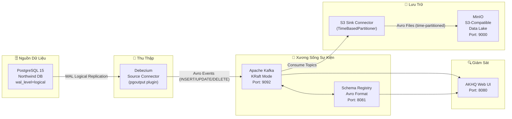

# 📐 Kiến Trúc Pipeline

Tài liệu này mô tả chi tiết kiến trúc end-to-end của CDC (Change Data Capture) Pipeline — từ cơ sở dữ liệu nguồn PostgreSQL đến Data Lake MinIO.

---

## Luồng Dữ Liệu Tổng Thể


> **Mô tả luồng**: PostgreSQL ghi thay đổi vào WAL → Debezium đọc WAL qua Logical Replication → đẩy Avro Events lên Apache Kafka (KRaft Mode) → Schema Registry validate cấu trúc Avro → S3 Sink Connector consume topics và ghi Avro files phân vùng theo ngày vào MinIO Data Lake.

<details>
<summary>📊 Xem dạng sơ đồ văn bản (Mermaid)</summary>



</details>

---

## Chi Tiết Từng Component

### 1. 🗄️ PostgreSQL 15 — Nguồn Dữ Liệu

**Container**: `postgres-db` | **Port**: `5432`

Đây là hệ thống cơ sở dữ liệu quan hệ (OLTP) chứa schema **Northwind** — một bộ dữ liệu thương mại điện tử mô phỏng với các bảng `orders`, `order_details`, `products`, `customers`.

**Cấu hình CDC quan trọng** (được set trong `docker-compose.yaml`):

| Tham Số | Giá Trị | Ý Nghĩa |
|---|---|---|
| `wal_level` | `logical` | Bật Logical Decoding để Debezium đọc WAL |
| `max_replication_slots` | `10` | Số slot nhân bản tối đa |
| `max_wal_senders` | `10` | Số kết nối WAL sender song song |

> **WAL (Write-Ahead Log)**: Postgres ghi mọi thay đổi vào WAL trước khi apply vào disk. Debezium đọc WAL này để bắt các sự kiện INSERT/UPDATE/DELETE mà **không cần trigger hay polling**.

**Các bảng được CDC theo dõi**:
- `public.orders`
- `public.order_details`
- `public.products`
- `public.customers`

---

### 2. 📡 Debezium Source Connector — Thu Thập Thay Đổi

**Plugin**: `debezium-connector-postgresql:2.4.2` | **Config**: [`connectors/debezium-postgres.json`](../connectors/debezium-postgres.json)

Debezium là một **Kafka Connect plugin** hoạt động như một consumer của Postgres WAL. Nó:

1. **Đọc WAL** liên tục thông qua `pgoutput` plugin (native của Postgres 10+)
2. **Chuyển đổi** mỗi thay đổi thành một **Avro event** có cấu trúc chuẩn Debezium envelope
3. **Đẩy** event vào Kafka topic tương ứng theo pattern `{topic.prefix}.{schema}.{table}`

**Cơ chế `REPLICA IDENTITY FULL`**: Mặc định Postgres chỉ log giá trị `after` khi UPDATE. Với `FULL`, cả `before` (snapshot dữ liệu cũ) cũng được ghi lại — cần thiết để downstream xử lý diff.

```
Topic được tạo:
  northwind.public.orders
  northwind.public.order_details
  northwind.public.products
  northwind.public.customers
```

---

### 3. 🚀 Apache Kafka — Xương Sống Sự Kiện

**Image**: `confluentinc/cp-kafka:7.4.0` | **Port**: `9092` (external), `29092` (internal)

Kafka đóng vai trò **buffer bất biến, có thứ tự, fault-tolerant** cho toàn bộ pipeline.

**Chế độ KRaft (không cần ZooKeeper)**:

```
Truyền thống: Kafka + ZooKeeper (2 hệ thống)
KRaft Mode:   Kafka tự quản lý metadata (1 hệ thống)
```

| Lý Do Chọn KRaft | Giải Thích |
|---|---|
| Đơn giản hóa | Không cần deploy & maintain ZooKeeper |
| Production-ready | Kafka 3.x chính thức hỗ trợ từ bản 3.3+ |
| Giảm latency | Ít hops mạng hơn khi leader election |

---

### 4. 📋 Schema Registry — Kiểm Soát Schema

**Image**: `confluentinc/cp-schema-registry:7.4.0` | **Port**: `8081`

Schema Registry lưu **Avro schemas** tập trung và enforce chúng khi producer ghi / consumer đọc.

**Tại sao Avro thay vì JSON?**

| Tiêu Chí | Avro | JSON |
|---|---|---|
| Kích thước | ✅ Nhỏ (binary) | ❌ Lớn (text) |
| Schema enforcement | ✅ Bắt buộc | ❌ Tùy chọn |
| Schema evolution | ✅ Backward/Forward compat | ❌ Không kiểm soát |
| Tốc độ đọc/ghi | ✅ Nhanh hơn | ❌ Chậm hơn |

---

### 5. 💾 S3 Sink Connector — Ghi Vào Data Lake

**Plugin**: `kafka-connect-s3:10.5.7` | **Config**: [`connectors/s3-sink-minio-production.json`](../connectors/s3-sink-minio-production.json)

Connector này consume các Kafka topics và ghi dữ liệu thành **Avro files phân vùng theo thời gian** vào MinIO.

**Cơ chế flush**:
```
Flush khi: số records >= 50 (flush.size)
       HOẶC: thời gian >= 60 giây (rotate.interval.ms)
(tùy điều kiện nào xảy ra trước)
```

**Partitioning layout trong MinIO**:
```
northwind-data-lake/
└── topics/
    └── northwind.public.orders/
        └── year=2024/
            └── month=01/
                └── day=15/
                    ├── northwind.public.orders+0+0000000000.avro
                    └── northwind.public.orders+0+0000000050.avro
```

---

### 6. 🪣 MinIO — Data Lake S3-Compatible

**Image**: `minio/minio` | **API Port**: `9000` | **UI Port**: `9001`

MinIO là object storage **tương thích hoàn toàn với Amazon S3 API**. Mọi công cụ dùng AWS S3 SDK đều dùng được với MinIO (Spark, Trino, dbt, ...).

---

### 7. 🔍 AKHQ — Kafka Web UI

**Image**: `tchiotludo/akhq` | **Port**: `8080`

Giao diện web để:
- Xem topics và messages realtime
- Kiểm tra consumer group lag
- Xem schemas đã đăng ký trong Schema Registry
- Theo dõi trạng thái Kafka Connect connectors

---

## Quyết Định Thiết Kế

| Quyết Định | Lựa Chọn | Lý Do |
|---|---|---|
| Kafka mode | KRaft (không ZooKeeper) | Đơn giản hóa infra, Confluent 7.4 đã stable |
| Serialization | Avro + Schema Registry | Type-safe, compact, schema evolution |
| Sink format | Avro (có thể đổi thành Parquet) | Tương thích connector S3 sẵn có |
| Partitioning | TimeBasedPartitioner (ngày) | Query theo date range dễ dàng |
| CDC plugin | `pgoutput` (native) | Không cần cài thêm extension vào Postgres |

---

## Cổng Dịch Vụ

| Service | Internal (Docker) | External (Host) |
|---|---|---|
| Kafka | `kafka:29092` | `localhost:9092` |
| Schema Registry | `schema-registry:8081` | `localhost:8081` |
| Kafka Connect | `kafka-connect:8083` | `localhost:8083` |
| AKHQ | - | `localhost:8080` |
| MinIO API | `minio:9000` | `localhost:9000` |
| MinIO Console | - | `localhost:9001` |
| PostgreSQL | `postgres-db:5432` | `localhost:5432` |
