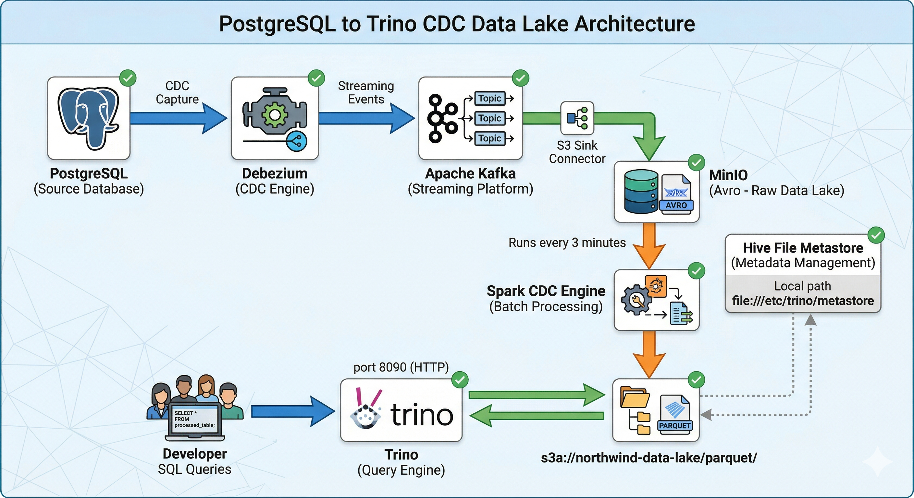

# 🔍 Trino — SQL Query Engine for Northwind Data Lake

Trino enables developers to query **Parquet files** written by Spark into MinIO using standard SQL — no data movement, no additional ETL required.

---

## Architecture


---

## Directory Structure

```
trino/
├── etc/
│   ├── config.properties          # Trino server config (port 8090, memory limits)
│   ├── jvm.config                 # JVM heap settings: -Xmx2G, G1GC
│   ├── log.properties             # Log level: INFO
│   ├── node.properties            # Node identity and data directory
│   └── catalog/
│       └── hive.properties        # MinIO connection via Hive file metastore
├── init/
│   └── create_tables.sql          # DDL to create schema and 4 Northwind external tables
├── mock/
│   └── mock_parquet_generator.py  # Generate mock Parquet data to test Trino before Spark is ready
└── README.md                      # This file
```

---

## Configuration

### Trino Server (`etc/config.properties`)

| Setting | Value | Description |
|---|---|---|
| `http-server.http.port` | `8090` | HTTP port for Trino UI and REST API |
| `query.max-memory` | `1GB` | Total distributed memory limit per query |
| `query.max-memory-per-node` | `512MB` | Per-node memory limit |

### JVM (`etc/jvm.config`)

```
-Xmx2G          # Maximum heap: 2 GB
-XX:+UseG1GC    # G1 Garbage Collector
```

### Hive Catalog (`etc/catalog/hive.properties`)

| Setting | Value | Description |
|---|---|---|
| `connector.name` | `hive` | Use the Hive connector |
| `hive.metastore` | `file` | File-based metastore — no separate HMS service needed |
| `hive.metastore.catalog.dir` | `file:///etc/trino/metastore` | Where table metadata is stored (Docker volume) |
| `hive.s3.endpoint` | `http://minio:9000` | MinIO internal endpoint |
| `hive.s3.path-style-access` | `true` | Required for MinIO (path-style vs virtual-hosted) |
| `hive.security` | `allow-all` | Permit all operations (suitable for dev environments) |
| `hive.non-managed-table-writes-enabled` | `true` | Allow writes to external tables |
| `hive.parquet.use-column-names` | `true` | Map by column name rather than position |

### Credentials

Passed via environment variables in `docker-compose.yaml`:

```yaml
environment:
  AWS_ACCESS_KEY_ID: ${MINIO_ROOT_USER}
  AWS_SECRET_ACCESS_KEY: ${MINIO_ROOT_PASSWORD}
```

---

## Getting Started

### Step 1 — Start the Trino service

```bash
# From the project root
docker-compose up -d trino
```

> ⏳ Trino takes approximately 15–30 seconds to fully initialize.

### Step 2 — Verify Trino is healthy

```bash
curl http://localhost:8090/v1/info
```

Expected response:
```json
{"nodeVersion":{"version":"435"},"environment":"production","starting":false,...}
```

Or check the logs:
```bash
docker logs trino
```

### Step 3 — Create schema and tables

```bash
docker exec -it trino trino --file /init/create_tables.sql
```

This script will:
1. Create schema `hive.northwind` pointing to `s3a://northwind-data-lake/parquet/`
2. Create 4 external tables: `orders`, `order_details`, `products`, `customers`
3. Sync partitions to detect existing data in MinIO

### Step 4 — Verify tables were created

```bash
docker exec -it trino trino --execute "SHOW TABLES FROM hive.northwind;"
```

Expected output:
```
     Table
--------------
 customers
 order_details
 orders
 products
(4 rows)
```

---

## Table Schemas

### `hive.northwind.orders`

| Column | Type | Notes |
|---|---|---|
| `order_id` | INTEGER | Primary key |
| `customer_id` | VARCHAR | Foreign key → customers |
| `employee_id` | INTEGER | |
| `order_date` | VARCHAR | ISO date string |
| `required_date` | VARCHAR | ISO date string |
| `shipped_date` | VARCHAR | ISO date string, nullable |
| `ship_via` | INTEGER | Shipper ID |
| `freight` | DOUBLE | Shipping cost |
| `ship_name` … `ship_country` | VARCHAR | Shipping destination fields |
| `cdc_op` | VARCHAR | CDC operation: `c` create / `u` update / `r` read (snapshot) |
| `cdc_ts_ms` | BIGINT | Debezium timestamp (milliseconds) |
| `year` / `month` / `day` | VARCHAR | Hive-style partition columns |

### `hive.northwind.order_details`

| Column | Type |
|---|---|
| `order_id` | INTEGER |
| `product_id` | INTEGER |
| `unit_price` | DOUBLE |
| `quantity` | INTEGER |
| `discount` | DOUBLE |
| `cdc_op` / `cdc_ts_ms` | VARCHAR / BIGINT |
| `year` / `month` / `day` | VARCHAR |

### `hive.northwind.products`

| Column | Type |
|---|---|
| `product_id` | INTEGER |
| `product_name` | VARCHAR |
| `supplier_id` / `category_id` | INTEGER |
| `quantity_per_unit` | VARCHAR |
| `unit_price` | DOUBLE |
| `units_in_stock` / `units_on_order` / `reorder_level` | INTEGER |
| `discontinued` | INTEGER (0 or 1) |
| `cdc_op` / `cdc_ts_ms` | VARCHAR / BIGINT |
| `year` / `month` / `day` | VARCHAR |

### `hive.northwind.customers`

| Column | Type |
|---|---|
| `customer_id` | VARCHAR |
| `company_name` / `contact_name` / `contact_title` | VARCHAR |
| `address` / `city` / `region` / `postal_code` / `country` | VARCHAR |
| `phone` / `fax` | VARCHAR |
| `cdc_op` / `cdc_ts_ms` | VARCHAR / BIGINT |
| `year` / `month` / `day` | VARCHAR |

---

## Query Examples

### Connect to Trino CLI

```bash
docker exec -it trino trino
```

### Basic queries

```sql
-- List all schemas
SHOW SCHEMAS FROM hive;

-- List all tables
SHOW TABLES FROM hive.northwind;

-- Sample the 10 most recent orders
SELECT order_id, customer_id, order_date, ship_city, cdc_op
FROM hive.northwind.orders
ORDER BY cdc_ts_ms DESC
LIMIT 10;

-- Filter by partition (efficient — triggers partition pruning)
SELECT *
FROM hive.northwind.orders
WHERE year = '2026' AND month = '04' AND day = '09';
```

### Analytical queries

```sql
-- Revenue per order (orders joined with order_details)
SELECT
    o.order_id,
    o.customer_id,
    o.ship_city,
    SUM(od.unit_price * od.quantity * (1 - od.discount)) AS total_revenue
FROM hive.northwind.orders o
JOIN hive.northwind.order_details od ON o.order_id = od.order_id
GROUP BY o.order_id, o.customer_id, o.ship_city
ORDER BY total_revenue DESC
LIMIT 20;

-- Top customers by total gross revenue
SELECT
    c.company_name,
    c.country,
    COUNT(DISTINCT o.order_id)           AS total_orders,
    SUM(od.unit_price * od.quantity)     AS gross_revenue
FROM hive.northwind.customers c
JOIN hive.northwind.orders o       ON c.customer_id = o.customer_id
JOIN hive.northwind.order_details od ON o.order_id = od.order_id
GROUP BY c.company_name, c.country
ORDER BY gross_revenue DESC
LIMIT 10;

-- Count CDC events by operation type
SELECT cdc_op, COUNT(*) AS event_count
FROM hive.northwind.orders
GROUP BY cdc_op;

-- Verify deduplication (expected: 0 rows if Spark ran correctly)
SELECT order_id, COUNT(*) AS cnt
FROM hive.northwind.orders
GROUP BY order_id
HAVING cnt > 1;

-- View all available partitions
SELECT DISTINCT year, month, day
FROM hive.northwind.orders
ORDER BY year, month, day;
```

### Sync partitions after a Spark run

```sql
-- Required after every Spark write so Trino detects newly written partitions
CALL hive.system.sync_partition_metadata('northwind', 'orders',        'FULL');
CALL hive.system.sync_partition_metadata('northwind', 'order_details', 'FULL');
CALL hive.system.sync_partition_metadata('northwind', 'products',      'FULL');
CALL hive.system.sync_partition_metadata('northwind', 'customers',     'FULL');
```

---

## Testing with Mock Data (no Spark required)

If Spark is not yet running, use the mock generator to test Trino independently:

```bash
# Install dependencies
pip install boto3 pandas pyarrow faker

# Upload mock Parquet files to MinIO
python trino/mock/mock_parquet_generator.py
```

The generator uploads Parquet files for all 4 tables at:
```
northwind-data-lake/parquet/<table>/year=YYYY/month=MM/day=DD/mock-data.parquet
```

Then create the tables and query:
```bash
docker exec -it trino trino --file /init/create_tables.sql
docker exec -it trino trino --execute "SELECT COUNT(*) FROM hive.northwind.orders;"
```

---

## Web UI Endpoints

| Interface | URL | Description |
|---|---|---|
| **Trino UI** | http://localhost:8090 | Query monitoring, active queries, cluster info |
| **MinIO Console** | http://localhost:9001 | Browse Parquet files directly in the browser |

---

## Troubleshooting

| Symptom | Check | Solution |
|---|---|---|
| Trino fails to start | `docker logs trino` | Verify all config files are correctly volume-mounted |
| `Table not found` | `SHOW TABLES FROM hive.northwind` | Re-run `create_tables.sql` |
| Query returns 0 rows | MinIO path, partition sync | Run `CALL sync_partition_metadata(...)` |
| `AccessDeniedException` | MinIO credentials | Verify `AWS_ACCESS_KEY_ID/SECRET` match your `.env` |
| `SSL not enabled` error | MinIO connection | Confirm `hive.s3.ssl.enabled=false` in `hive.properties` |
| Partition not visible | File metastore does not auto-sync | Manually run `sync_partition_metadata` after every Spark run |

---

## Contract with Spark

Trino reads Parquet in the exact structure Spark writes. Spark **must** guarantee:

### Path Layout

```
northwind-data-lake/
└── parquet/
    ├── orders/
    │   └── year=YYYY/month=MM/day=DD/
    │       └── part-*.snappy.parquet    ← Trino reads here
    ├── order_details/
    ├── products/
    └── customers/
```

### Schema Requirements

- All columns from the source table (flattened from `after` in the Debezium envelope)
- `cdc_op` (VARCHAR) — CDC event type: `c` (create), `u` (update), `r` (read/snapshot)
- `cdc_ts_ms` (BIGINT) — Debezium event timestamp in milliseconds
- `year`, `month`, `day` (VARCHAR) — Hive-style partition columns

### Critical Type Mappings

| Column | Parquet → Trino | Notes |
|---|---|---|
| `order_date` | VARCHAR | Not DATE — avoids timezone conversion issues |
| `quantity` | INTEGER | Not SMALLINT — Python int serializes as INT64 |
| `units_in_stock` | INTEGER | Not SMALLINT |
| `discontinued` | INTEGER | 0 or 1 |

---

## Related

- **Spark README**: [`../spark/README.md`](../spark/README.md)
- **docker-compose.yaml**: [`../docker-compose.yaml`](../docker-compose.yaml)
- **Architecture docs**: [`../docs/architecture.md`](../docs/architecture.md)
- **Data contracts**: [`../docs/contracts.md`](../docs/contracts.md)
